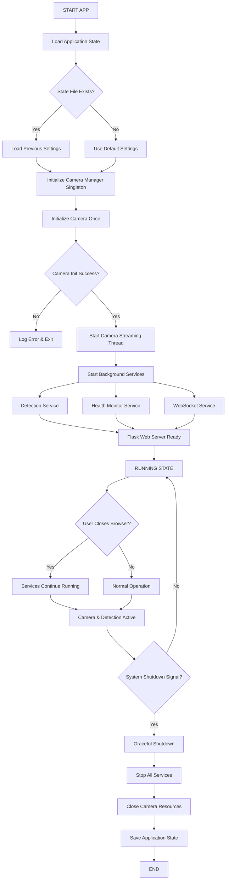
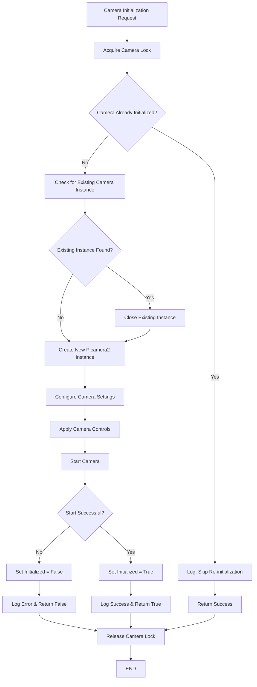
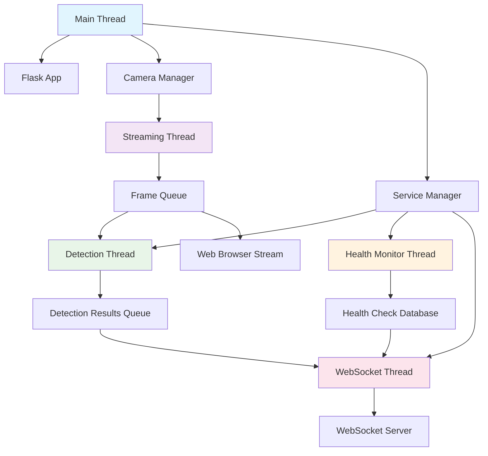
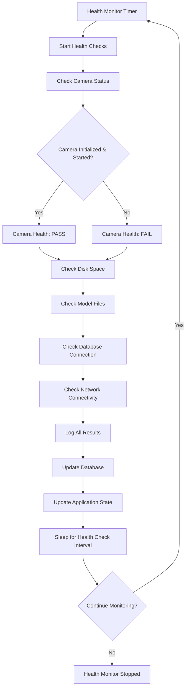
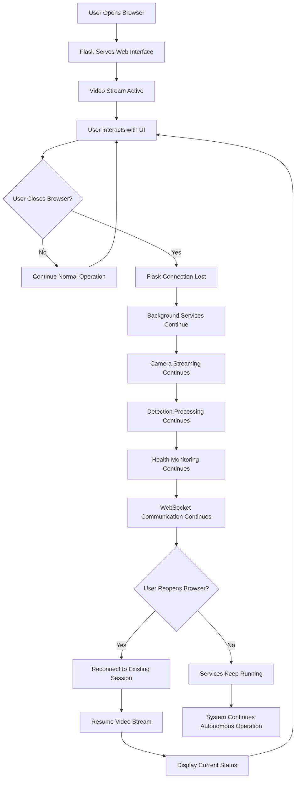

# Improved Application Flowchart & Architecture

## Executive Summary

This document outlines the improved application architecture that addresses:
1. **Prevents multiple camera initialization** through singleton pattern
2. **Enables simultaneous camera and detection operation** even when user exits browser
3. **Proper health checking** without disrupting camera operations
4. **State persistence** across browser sessions
5. **Robust threading model** with proper lifecycle management

## Main Application Flow



## Camera Initialization Flow



## Threading Architecture



## State Persistence Model

```mermaid
flowchart TD
    A[Application Startup] --> B[ApplicationState.load_state()]
    B --> C{app_state.json exists?}
    C -->|Yes| D[Load Previous Configuration]
    C -->|No| E[Use Default Configuration]
    D --> F[Apply Camera Settings]
    E --> F
    F --> G[Start Services Based on State]
    G --> H[Normal Operation]
    H --> I[State Changes Occur]
    I --> J[ApplicationState.update_state()]
    J --> K[Save to app_state.json]
    K --> L{More Operations?}
    L -->|Yes| H
    L -->|No| M[Application Shutdown]
    M --> N[Final State Save]
    N --> O[END]
```

## Health Check Flow (Non-Disruptive)



## Browser Disconnection Handling



## Key Improvements Over Original Design

### 1. Camera Initialization Prevention
- **Before**: Multiple initialization attempts causing resource conflicts
- **After**: Singleton pattern with `initialize_camera_once()` method
- **Benefit**: Prevents "Camera in use" errors and resource conflicts

### 2. Persistent Operation
- **Before**: All threads stop when browser closes
- **After**: Background services (detection, health monitoring) continue running
- **Benefit**: Continuous monitoring and data collection

### 3. Health Check Non-Disruption
- **Before**: Health checks could interfere with camera operations
- **After**: Health checks use separate status queries without camera operations
- **Benefit**: Monitoring doesn't disrupt core functionality

### 4. State Persistence
- **Before**: No state management across sessions
- **After**: JSON-based state persistence with automatic restore
- **Benefit**: Maintains configuration and operation status

### 5. Improved Error Handling
- **Before**: Basic error handling with potential resource leaks
- **After**: Comprehensive error handling with resource cleanup
- **Benefit**: More robust and reliable operation

## Implementation Checklist

- [x] Design improved architecture
- [ ] Implement ApplicationState class
- [ ] Implement ImprovedCameraManager with singleton pattern
- [ ] Implement ServiceManager with proper lifecycle management  
- [ ] Create non-disruptive health checking
- [ ] Add state persistence layer
- [ ] Test browser disconnection scenarios
- [ ] Test camera initialization edge cases
- [ ] Integrate with existing detection logic
- [ ] Performance testing and optimization

## Migration Strategy

1. **Phase 1**: Implement new architecture alongside existing code
2. **Phase 2**: Gradually migrate services to new architecture
3. **Phase 3**: Test thoroughly with existing functionality
4. **Phase 4**: Replace original implementation
5. **Phase 5**: Remove deprecated code and optimize

This improved architecture ensures robust, persistent operation while preventing the common issues of multiple camera initialization and service disruption when users disconnect from the web interface.