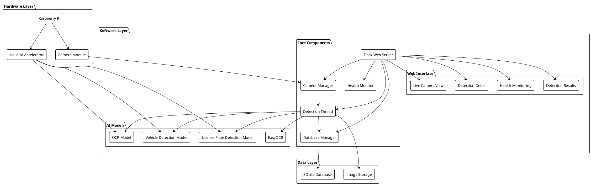
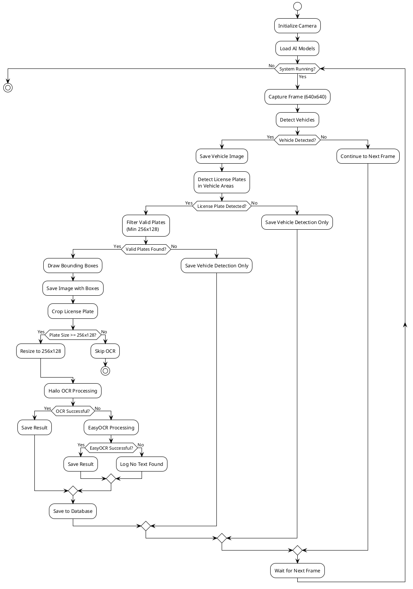
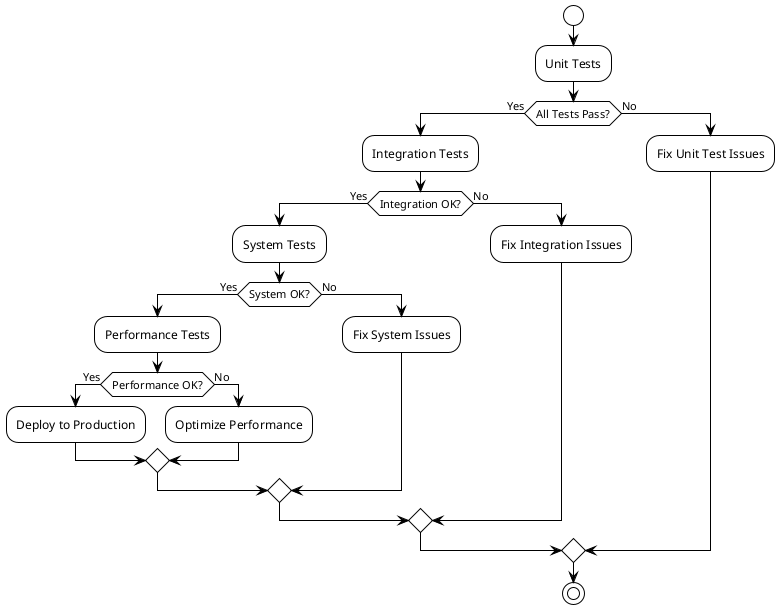

# AI Camera System v2 - ระบบกล้องปัญญาประดิษฐ์

## 📋 ภาพรวมโครงการ

ระบบกล้องปัญญาประดิษฐ์สำหรับการตรวจจับยานพาหนะและอ่านป้ายทะเบียนรถยนต์ โดยใช้เทคโนโลยี AI และ Computer Vision บน Raspberry Pi ร่วมกับ Hailo AI Accelerator

## 🎯 วัตถุประสงค์

- ตรวจจับยานพาหนะในเวลาจริง
- อ่านป้ายทะเบียนรถยนต์ด้วย OCR
- บันทึกและจัดเก็บข้อมูลการตรวจจับ
- แสดงผลผ่าน Web Interface
- ตรวจสอบสถานะระบบ (Health Monitoring)

## 🏗️ สถาปัตยกรรมระบบ

### PlantUML System Architecture



## 🔄 การทำงานของระบบ

### PlantUML Detection Workflow



## 📁 โครงสร้างโปรเจค

```
v2/
├── app.py                     # Flask application main
├── camera_config.py           # Camera configuration
├── config.py                  # System configuration
├── database_manager.py        # Database operations
├── detection_thread.py        # AI detection processing
├── health_monitor.py          # System health monitoring
├── image_processing.py        # Image processing utilities
├── logging_config.py          # Logging configuration
├── run_app.sh                 # Application startup script
├── generate_test_data.py      # Test data generator
├── create_sample_data.py      # Sample data creator
├── .env.production            # Environment variables
├── camera_state.json          # Camera state persistence
├── db/                        # Database files
│   └── lpr_data.db
├── captured_images/           # Detection result images
├── static/                    # Web static files
│   ├── css/
│   │   ├── main.css
│   │   ├── detection.css
│   │   └── health.css
│   ├── js/
│   │   ├── detection.js
│   │   └── health.js
│   └── images/
│       └── 123.jpg
├── templates/                 # HTML templates
│   ├── index.html
│   ├── detection.html
│   ├── detection_detail.html
│   └── health.html
└── tests/                     # Test files
    └── test_*.py
```

## 🚀 การติดตั้งและใช้งาน

### ข้อกำหนดระบบ

- Raspberry Pi 4 (4GB RAM)
- Hailo AI Accelerator
- Camera Module (PiCamera2)
- Python 3.8+
- HAILO Environment

### การติดตั้ง

1. **Clone โปรเจค**
```bash
git clone <repository-url>
cd aicamera/v2
```

2. **ติดตั้ง Dependencies**
```bash
# Activate HAILO environment
source /home/camuser/aicamera/setup_env.sh

# Install Python dependencies
pip install -r requirements.txt
```

3. **ตั้งค่า Environment**
```bash
# Copy environment file
cp .env.example .env.production

# Edit configuration
nano .env.production
```

4. **รันแอปพลิเคชัน**
```bash
# Start application
./run_app.sh

# หรือรันโดยตรง
python app.py
```

### การใช้งาน

1. **เปิด Web Interface**: `http://localhost:5000`
2. **Live Camera**: ดูภาพกล้องแบบ Real-time
3. **Detection Results**: ดูผลการตรวจจับและป้ายทะเบียน
4. **Health Monitoring**: ตรวจสอบสถานะระบบ

## 🔧 การพัฒนา

### การเพิ่มฟีเจอร์ใหม่

1. **สร้าง Feature Branch**
```bash
git checkout -b feature/new-feature
```

2. **พัฒนาและทดสอบ**
```bash
# Run tests
python -m pytest tests/

# Generate test data
python generate_test_data.py
```

3. **Commit และ Push**
```bash
git add .
git commit -m "Add new feature"
git push origin feature/new-feature
```

### การ Debug

```bash
# Check logs
tail -f logs/app.log

# Test database
python -c "from database_manager import DatabaseManager; db = DatabaseManager(); print('DB OK')"

# Test models
python tests/test_models.py
```

## 📊 การทดสอบ

### PlantUML Test Flow



### การทดสอบระบบ

1. **Unit Tests**
```bash
python -m pytest tests/test_*.py -v
```

2. **Integration Tests**
```bash
python tests/test_integration.py
```

3. **System Tests**
```bash
# Start application
./run_app.sh &

# Run system tests
python tests/test_system.py

# Stop application
pkill -f "python.*app.py"
```

## 📈 การ Monitor และ Maintenance

### Health Monitoring

ระบบจะตรวจสอบ:
- Camera Status
- CPU & RAM Usage
- Disk Space
- AI Models Status
- Database Connection
- Network Connectivity

### Logging

- **Application Logs**: `logs/app.log`
- **Detection Logs**: `logs/detection.log`
- **Health Logs**: `logs/health.log`

### Performance Metrics

- Frame Processing Rate
- Detection Accuracy
- OCR Success Rate
- System Response Time

## 🔒 ความปลอดภัย

- API Authentication
- Input Validation
- SQL Injection Prevention
- File Upload Security
- Error Handling

## 📝 การอัปเดต

### Version History

- **v2.0.0**: Initial release with basic detection
- **v2.1.0**: Added health monitoring
- **v2.2.0**: Improved OCR accuracy
- **v2.3.0**: Enhanced web interface

### การอัปเดต

```bash
# Backup current version
cp -r v2 v2_backup_$(date +%Y%m%d)

# Update code
git pull origin main

# Test new version
python tests/test_all.py

# Deploy if tests pass
./run_app.sh
```

## 🤝 การสนับสนุน

### การรายงานปัญหา

1. ตรวจสอบ logs ก่อน
2. สร้าง issue ใน GitHub
3. แนบข้อมูล:
   - Error logs
   - System information
   - Steps to reproduce

### การติดต่อ

- **Email**: support@aicamera.com
- **GitHub**: https://github.com/aicamera/issues
- **Documentation**: https://aicamera.readthedocs.io

## 📄 License

MIT License - ดูรายละเอียดใน [LICENSE](LICENSE) file

---

**พัฒนาโดย**: AI Camera Development Team  
**เวอร์ชัน**: 2.3.0  
**อัปเดตล่าสุด**: August 2024  